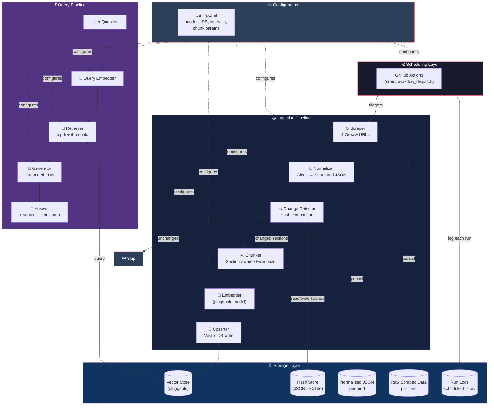
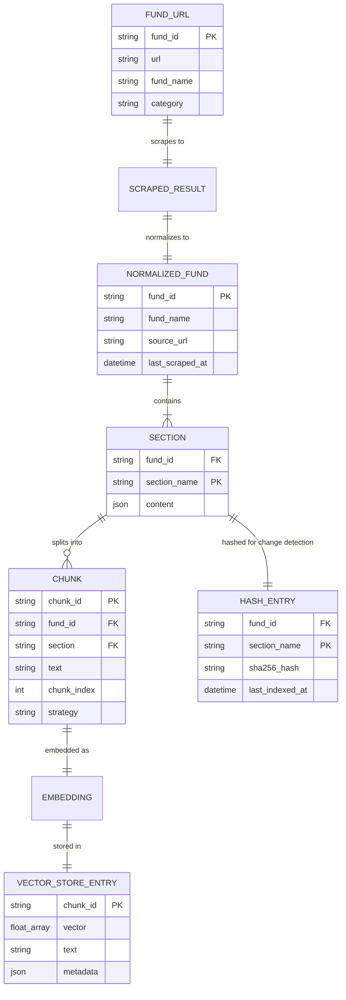
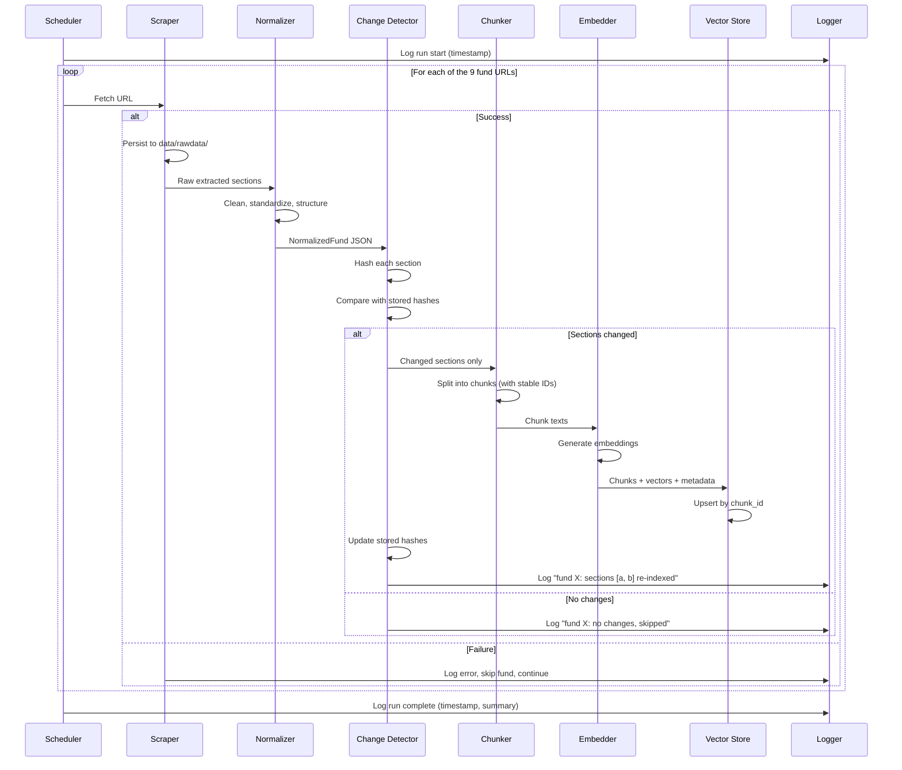
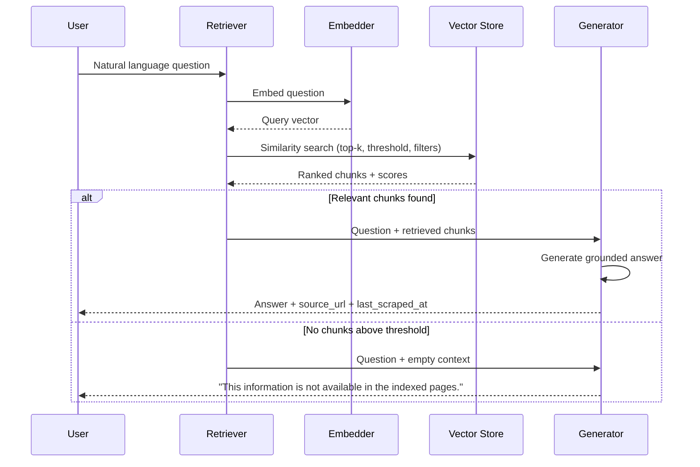
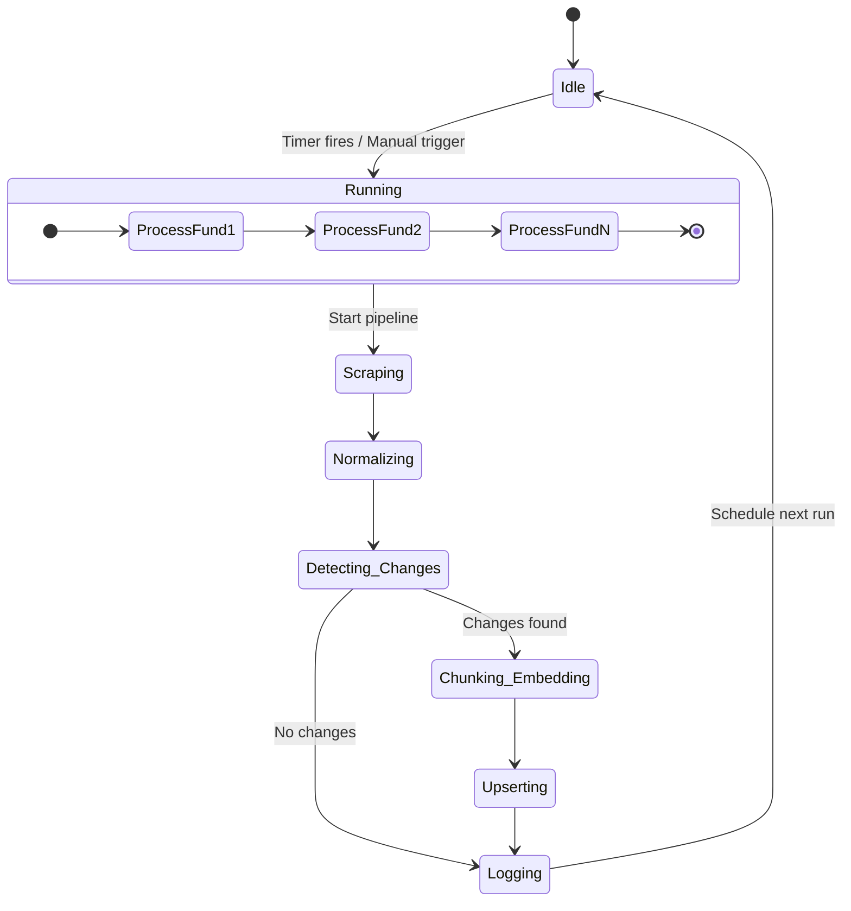
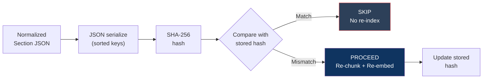
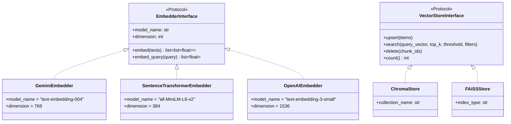
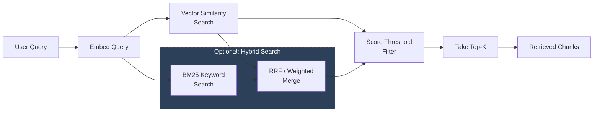
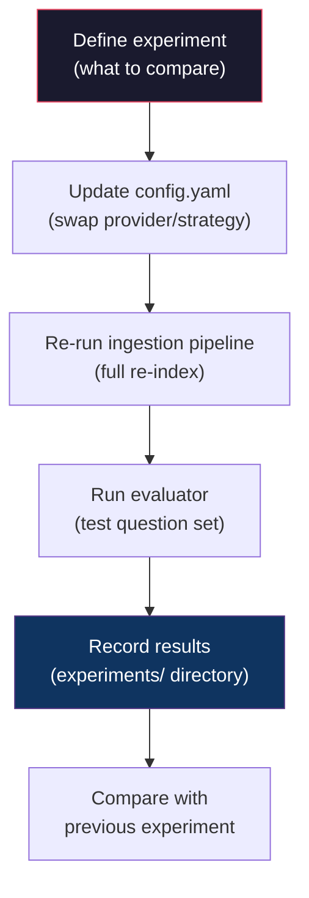

# 🏗️ Architecture — Mutual Fund FAQ Assistant

> **Derived from:** [ProblemStatement.md](file:///d:/GenAI/Practice/RAG_UC/docs/ProblemStatement.md)
> **Document Version:** 1.0
> **Date:** 24 August 2026

---

## System Architecture — Visual Overview


---

## Table of Contents

1. [Architecture Overview](#1-architecture-overview)
2. [High-Level System Diagram](#2-high-level-system-diagram)
3. [Component Architecture](#3-component-architecture)
4. [Data Models & Schemas](#4-data-models--schemas)
5. [Technology Stack & Candidates](#5-technology-stack--candidates)
6. [Directory / Project Layout](#6-directory--project-layout)
7. [Configuration Strategy](#7-configuration-strategy)
8. [Data Flow — Ingestion Pipeline](#8-data-flow--ingestion-pipeline)
9. [Data Flow — Query Pipeline](#9-data-flow--query-pipeline)
10. [Scheduler & Freshness Design](#10-scheduler--freshness-design)
11. [Change Detection Strategy](#11-change-detection-strategy)
12. [Chunking Strategies](#12-chunking-strategies)
13. [Embedding & Vector Store Abstraction](#13-embedding--vector-store-abstraction)
14. [Retrieval & Generation Design](#14-retrieval--generation-design)
15. [Experimentation Framework](#15-experimentation-framework)
16. [Logging & Observability](#16-logging--observability)
17. [Error Handling & Resilience](#17-error-handling--resilience)
18. [Requirement Traceability Matrix](#18-requirement-traceability-matrix)

---

## 1. Architecture Overview

The system is a **local, single-user RAG pipeline** built for learning. It is composed of two independent execution paths that share a common vector store:

| Path | Trigger | Purpose |
|------|---------|---------|
| **Ingestion Pipeline** | GitHub Actions (cron/manual) | Scrape → Normalize → Detect Changes → Chunk → Embed → Upsert |
| **Query Pipeline** | User question (interactive) | Embed Query → Retrieve → Generate → Respond |

Both paths are orchestrated by a lightweight **Pipeline Orchestrator** that manages configuration, logging, and component wiring.

### Design Principles

| Principle | Rationale |
|-----------|-----------|
| **Pluggable components** | Embedding models, vector stores, and chunking strategies must be swappable via config for experimentation _(FR12, L4, L5, L3)_. |
| **Incremental updates** | Change detection avoids redundant work; upserts prevent stale duplicates _(FR10, L9, R3, R4)_. |
| **Graceful degradation** | One failed page must not crash the full pipeline _(Assumption A3)_. |
| **Separation of concerns** | Each pipeline stage is a distinct module with a clear interface contract. |
| **Config-driven behavior** | Intervals, model names, DB paths, chunk sizes — all configurable, never hardcoded _(FR9, FR12)_. |

---

## 2. High-Level System Diagram



---

## 3. Component Architecture

Each pipeline stage is a self-contained module with a defined input/output contract. This section details every component.

---

### 3.1 Scraper (`scraper`)

> **Maps to:** FR1, L1, Stage 1

| Aspect | Detail |
|--------|--------|
| **Responsibility** | Fetch raw HTML from each of the 9 Groww URLs and extract the fund-fact DOM sections (§4A of the problem statement), discarding boilerplate/noise (§4B). |
| **Input** | List of 9 URLs (from config). |
| **Output** | Raw extracted content per fund (HTML fragments or pre-parsed text blocks for each section: NAV, returns, AUM, holdings, fund manager, etc.). |
| **Extraction approach** | Use CSS selectors and/or XPath targeting labeled fields/headers — NOT rigid positional parsing (mitigates R1). |
| **Noise rejection** | Explicitly skip: global nav, footer, "Compare similar funds" tables, site-wide link directories. |
| **Error handling** | If a single page fails (network error, changed layout), log the failure, skip that fund, and continue with the remaining 8 _(Assumption A3)_. |
| **Persistence** | Write raw extracted content to `data/rawdata/<fund_id>.json` for manual verification and debugging. |
| **Rate limiting** | Sequential requests with a configurable delay between pages (default: 2–3 seconds) to be respectful _(R2, A2)_. |
| **HTTP headers** | Standard browser-like `User-Agent`, `Accept-Language`. |

#### Scraper Interface (Conceptual)

```python
class ScraperResult:
    fund_id: str               # e.g. "hdfc_small_cap"
    fund_name: str             # e.g. "HDFC Small Cap Fund"
    source_url: str
    raw_sections: dict[str, str]   # section_name → raw extracted text/HTML
    scraped_at: datetime
    success: bool
    error: str | None

def scrape_all(urls: list[str], config: ScraperConfig) -> list[ScraperResult]:
    ...
```

---

### 3.2 Normalizer (`normalizer`)

> **Maps to:** FR2, L2, Stage 2

| Aspect | Detail |
|--------|--------|
| **Responsibility** | Transform raw scraped content into a clean, consistent, structured JSON record per fund. |
| **Input** | `ScraperResult` per fund (raw section texts). |
| **Output** | `NormalizedFund` — a structured JSON object with standardized field names, clean values, and metadata. |
| **Field standardization** | Canonicalize names (e.g. always `expense_ratio` regardless of page wording). Normalize currency to numeric (₹500 → 500), percentages to float (1.05% → 1.05), dates to ISO 8601. |
| **Section mapping** | Map raw page sections to canonical sections: `overview`, `returns`, `holdings`, `exit_load`, `tax_info`, `fund_manager`, `amc_details`. |
| **Persistence** | Write normalized JSON to `data/normalized/<fund_id>.json` for debugging and change-detection input. |

#### Normalized Fund Schema (Conceptual)

```json
{
  "fund_id": "hdfc_small_cap",
  "fund_name": "HDFC Small Cap Fund",
  "source_url": "https://groww.in/mutual-funds/hdfc-small-cap-fund-direct-growth",
  "last_scraped_at": "2026-08-24T00:30:00+05:30",
  "overview": {
    "nav": 98.45,
    "aum_cr": 33250.0,
    "expense_ratio": 0.68,
    "risk_category": "Very High",
    "category": "Small Cap",
    "rating": 4,
    "benchmark": "NIFTY Smallcap 250 TRI",
    "min_sip": 500,
    "min_lumpsum": 5000,
    "launch_date": "2008-02-19"
  },
  "returns": {
    "1d": 0.52,
    "1y": 22.35,
    "3y": 18.67,
    "5y": 28.12,
    "category_avg": { "1y": 20.1, "3y": 17.5, "5y": 25.8 }
  },
  "holdings": [
    { "name": "Stock A", "sector": "Technology", "instrument": "Equity", "pct_assets": 3.2 }
  ],
  "exit_load": "1% if redeemed within 1 year",
  "stamp_duty": "0.005%",
  "tax_info": {
    "ltcg": "12.5% above ₹1.25 lakh",
    "stcg": "20%"
  },
  "fund_manager": {
    "name": "Manager Name",
    "tenure": "5 years",
    "education": "MBA Finance",
    "prior_experience": "...",
    "other_schemes": ["...", "..."]
  },
  "amc_details": {
    "name": "HDFC Asset Management Company Ltd",
    "total_aum_cr": 650000.0,
    "incorporated": "1999-12-10",
    "registrar": "..."
  }
}
```

---

### 3.3 Change Detector (`change_detector`)

> **Maps to:** FR10, L9, Stage 3, R3

| Aspect | Detail |
|--------|--------|
| **Responsibility** | Determine which funds/sections have changed since the last successful scrape, so only changed content proceeds to chunking/embedding. |
| **Input** | Current `NormalizedFund` + previously stored content hashes. |
| **Output** | Per-fund, per-section change manifest: `{ section_name: changed | unchanged }`. |
| **Hashing strategy** | SHA-256 hash of the JSON-serialized value of each canonical section (after normalization, to avoid false positives from whitespace or formatting changes). |
| **Hash storage** | `data/hashes/<fund_id>.json` — maps `section_name → hash_value` from the last indexed run. |
| **First run behavior** | No previous hashes → treat everything as changed (full initial index). |

#### Change Manifest (Conceptual)

```json
{
  "fund_id": "hdfc_small_cap",
  "overall_changed": true,
  "sections": {
    "overview": "changed",
    "returns": "changed",
    "holdings": "unchanged",
    "exit_load": "unchanged",
    "tax_info": "unchanged",
    "fund_manager": "unchanged",
    "amc_details": "unchanged"
  }
}
```

---

### 3.4 Chunker (`chunker`)

> **Maps to:** FR3, L3, Stage 4

| Aspect | Detail |
|--------|--------|
| **Responsibility** | Split normalized fund content into chunks suitable for embedding and retrieval. |
| **Input** | `NormalizedFund` JSON (only the changed sections, per change manifest). |
| **Output** | List of `Chunk` objects with text content, metadata, and a stable ID. |
| **Strategies (pluggable)** | See [§12 Chunking Strategies](#12-chunking-strategies) for full details. |
| **Stable chunk ID** | `{fund_id}::{section_name}::{chunk_index}` — ensures upserts replace the correct stale chunks _(R4)_. |

#### Chunk Schema

```python
class Chunk:
    chunk_id: str              # stable ID for upsert: "hdfc_small_cap::overview::0"
    fund_id: str
    fund_name: str
    section: str               # canonical section name
    text: str                  # the chunk content
    source_url: str
    last_scraped_at: datetime
    chunk_index: int           # position within section
    strategy: str              # "section_aware" | "fixed_size" (for experiment tracking)
```

---

### 3.5 Embedder (`embedder`)

> **Maps to:** FR3, L4, Stage 5

| Aspect | Detail |
|--------|--------|
| **Responsibility** | Generate vector embeddings for chunk text content. Also used to embed user queries during the query pipeline. |
| **Input** | List of chunk text strings. |
| **Output** | List of embedding vectors (float arrays). |
| **Pluggability** | The embedding model is selected via config. The module exposes a unified `embed(texts) → vectors` interface regardless of the underlying model _(FR12)_. |
| **Candidates** | See [§5 Technology Stack](#5-technology-stack--candidates) for model options. |
| **Batching** | Embed in batches to respect API rate limits and optimize throughput. |

#### Embedder Interface (Conceptual)

```python
class EmbedderInterface(Protocol):
    model_name: str
    dimension: int

    def embed(self, texts: list[str]) -> list[list[float]]:
        """Embed a batch of text strings into vectors."""
        ...

    def embed_query(self, query: str) -> list[float]:
        """Embed a single query string."""
        ...
```

---

### 3.6 Vector Store (`vector_store`)

> **Maps to:** FR4, FR6, L5, Stage 6, R4

| Aspect | Detail |
|--------|--------|
| **Responsibility** | Persist chunk embeddings with metadata; support similarity search and upserts. |
| **Input (write)** | Chunks + embedding vectors + metadata. |
| **Input (read)** | Query embedding vector + search params (top-k, threshold). |
| **Output** | Ranked list of matching chunks with scores. |
| **Upsert semantics** | Must support upsert by `chunk_id` — overwriting stale chunks rather than creating duplicates _(R4)_. |
| **Pluggability** | The vector store backend is selected via config _(FR12)_. |
| **Metadata filtering** | Support filtering by `fund_id`, `section`, `fund_name` during retrieval. |

#### Vector Store Interface (Conceptual)

```python
class VectorStoreInterface(Protocol):
    def upsert(self, items: list[VectorItem]) -> None:
        """Insert or update items by chunk_id."""
        ...

    def search(self, query_vector: list[float], top_k: int = 5,
               threshold: float | None = None,
               filters: dict | None = None) -> list[SearchResult]:
        """Return top-k most similar items, optionally filtered."""
        ...

    def delete(self, chunk_ids: list[str]) -> None:
        """Delete chunks by ID (for removed content)."""
        ...

    def count(self) -> int:
        """Total items in the store."""
        ...
```

#### VectorItem & SearchResult

```python
class VectorItem:
    chunk_id: str
    vector: list[float]
    text: str
    metadata: dict   # fund_id, fund_name, section, source_url, last_scraped_at, strategy

class SearchResult:
    chunk_id: str
    text: str
    metadata: dict
    score: float
```

---

### 3.7 Retriever (`retriever`)

> **Maps to:** FR6, L6, Stage 7

| Aspect | Detail |
|--------|--------|
| **Responsibility** | Given a user query, find the most relevant chunks from the vector store using Self-Querying (Metadata extraction). |
| **Input** | Natural-language question string. |
| **Output** | Ranked list of `SearchResult` chunks to pass to the generator. |
| **Steps** | 1) Extract metadata filters (`fund_id`, `section`) from query using a lightweight LLM router. 2) Embed the query. 3) Run vector similarity search applying the metadata filters (`where` clause). 4) Apply score threshold filtering. 5) Return top-k results. |
| **Tunable parameters** | `top_k`, `similarity_threshold`, `self_query.enabled` (all from config) _(L6)_. |

---

### 3.8 Generator (`generator`)

> **Maps to:** FR7, FR8, L7, Stage 8

| Aspect | Detail |
|--------|--------|
| **Responsibility** | Given retrieved chunks and a user question, generate a grounded, factual answer. |
| **Input** | User question + list of retrieved chunks (with metadata). |
| **Output** | Answer text + source URL(s) + last-scraped timestamp(s). |
| **Grounding rule** | Answer **only** from the provided chunks. If the information is not present, respond with _"This information is not available in the indexed pages."_ _(FR7, L7)_. |
| **Citation** | Every answer must cite the `source_url` and `last_scraped_at` of the data it used _(FR8)_. |
| **LLM / Constraints** | Configurable LLM backend (e.g. Groq, OpenAI, local model). **Constraint:** Groq Free Tier has strict limits (30 RPM, 8K TPM, 1K RPD). Context size (`top_k`) must be kept small (e.g. 1-3) to avoid hitting the 8K TPM limit during retrieval. |

#### System Prompt Template (Conceptual)

```text
You are a mutual fund fact assistant. Answer ONLY using the provided context chunks.
If the answer is not present in the chunks, say: "This information is not available
in the indexed pages."

For every fact you state, cite the source URL and the data freshness timestamp.

Context chunks:
{chunks}

User question: {question}
```

---

### 3.9 Scheduler (`scheduler`)

> **Maps to:** FR9, FR11, L8, Stage 0

| Aspect | Detail |
|--------|--------|
| **Responsibility** | Trigger the ingestion pipeline on a configurable interval via CI/CD; commit outputs (raw data, normalized data, embeddings) back to repo. |
| **Implementation** | GitHub Actions workflow (`.github/workflows/schedule.yml`). Runs `python -m src.main ingest`. |
| **Manual trigger** | Callable via GitHub Actions `workflow_dispatch` or CLI for development/debugging. |
| **Logging** | Managed by GitHub Actions run history _(FR11)_. |

See [§10 Scheduler & Freshness Design](#10-scheduler--freshness-design) for detailed design.

---

### 3.10 Evaluator (`evaluator`)

> **Maps to:** Stage 9, SC3–SC7

| Aspect | Detail |
|--------|--------|
| **Responsibility** | Run the sample test question set against the pipeline and report results. |
| **Input** | List of test questions with expected answer patterns / expected sources. |
| **Output** | Evaluation report: per-question result (correct / incorrect / correctly declined), retrieval metrics (chunks retrieved, scores), and overall accuracy. |
| **Scheduler verification** | Includes tests that re-ask questions after a scheduled refresh to confirm updated values propagate _(SC6)_. |

---

## 4. Data Models & Schemas

### 4.1 Entity Relationship



### 4.2 Canonical Section Names

Every fund is decomposed into the same set of canonical sections for consistent chunking and change detection:

| Section Name | Content | Volatility |
|-------------|---------|------------|
| `overview` | NAV, AUM, expense ratio, risk, category, rating, benchmark, min SIP/lumpsum, launch date | **High** (NAV daily) |
| `returns` | 1D/1Y/3Y/5Y returns, category average comparisons, rankings | **High** (daily) |
| `holdings` | Top holdings table (name, sector, instrument, % assets) | **Medium** (monthly) |
| `exit_load` | Exit load rules, stamp duty | **Low** (rarely changes) |
| `tax_info` | LTCG/STCG treatment | **Low** (rarely changes) |
| `fund_manager` | Manager name, tenure, education, experience, other schemes | **Low** (rarely changes) |
| `amc_details` | AMC name, total AUM, incorporation date, registrar, contact | **Low** (rarely changes) |

> [!TIP]
> The volatility column informs the scheduling design — high-volatility sections benefit from faster refresh intervals, while low-volatility sections can use slower cadences.

---

## 5. Technology Stack & Candidates

> [!IMPORTANT]
> The architecture is designed for **pluggability**. The "Primary" column indicates the initial implementation; "Alternative(s)" are swapped in for experimentation _(L4, L5, L3)_.

### 5.1 Core Stack

| Layer | Technology | Rationale |
|-------|-----------|-----------|
| **Language** | Python 3.11+ | Richest ecosystem for ML/NLP, scraping, and RAG tooling. |
| **Package manager** | `pip` + `venv` (or `uv`) | Standard, lightweight dependency management. |
| **Configuration** | YAML (`config.yaml`) | Human-readable, supports nested structures. |
| **Logging** | Python `logging` module → structured JSON logs | Simple, built-in, sufficient for local learning. |

### 5.2 Scraping

| Tool | Role | Notes |
|------|------|-------|
| **`requests`** | HTTP fetching | Lightweight, reliable. |
| **`BeautifulSoup4`** | HTML parsing & CSS selector-based extraction | Good balance of power and simplicity. |
| **`lxml`** _(optional)_ | Faster HTML parser backend for BS4 | Swap in if parsing speed matters. |

### 5.3 Embedding Models (Experiment: L4)

| # | Model | Source | Dimension | Notes |
|---|-------|--------|-----------|-------|
| 1 | **`text-embedding-004`** | Google (Gemini API) | 768 | Primary — high-quality, cloud-based. |
| 2 | **`all-MiniLM-L6-v2`** | Sentence-Transformers (HuggingFace) | 384 | Alternative — local, fast, free. |
| 3 | **`text-embedding-3-small`** | OpenAI | 1536 | Alternative — comparison with Google. |

### 5.4 Vector Stores (Experiment: L5)

| # | Store | Type | Upsert Support | Notes |
|---|-------|------|---------------|-------|
| 1 | **ChromaDB** | Embedded (local) | ✅ Native | Primary — zero-infra, Python-native, great for prototyping. |
| 2 | **FAISS** (+ metadata sidecar) | Embedded (local) | ⚠️ Manual (delete+add) | Alternative — raw speed, industry standard. |

### 5.5 LLM for Generation

| Model | Source | Notes |
|-------|--------|-------|
| **openai/gpt-oss-120b** | Groq API | Primary — lightning-fast inference for grounded Q&A. |
| **mixtral-8x7b-32768** _(optional)_ | Groq API | For comparison on harder cross-fund questions requiring larger context. |

### 5.6 Scheduler

| Approach | Library | Notes |
|----------|---------|-------|
| **CI/CD** | `GitHub Actions` | Triggers pipeline on cron schedule, allowing UI visualization of status and data commits. |

---

## 6. Directory / Project Layout

```
RAG_UC/
├── docs/
│   ├── ProblemStatement.txt            # Original scope (plain text)
│   ├── ProblemStatement.md             # Detailed scope (markdown)
│   └── Architecture.md                 # ← This document
│
├── config/
│   └── config.yaml                     # All configurable params
│
├── src/
│   ├── __init__.py
│   ├── main.py                         # CLI entry point
│   ├── pipeline.py                     # Orchestrates ingestion pipeline
│   │
│   ├── scraper/
│   │   ├── __init__.py
│   │   ├── scraper.py                  # Core scraping logic
│   │   ├── selectors.py                # CSS selectors / extraction rules per section
│   │   └── urls.py                     # The 9 fund URLs + fund_id mapping
│   │
│   ├── normalizer/
│   │   ├── __init__.py
│   │   ├── normalizer.py               # Raw → structured JSON transformation
│   │   └── field_mappings.py           # Field name canonicalization rules
│   │
│   ├── change_detector/
│   │   ├── __init__.py
│   │   └── detector.py                 # Hash-based change detection
│   │
│   ├── chunker/
│   │   ├── __init__.py
│   │   ├── chunker.py                  # Chunking orchestration
│   │   ├── section_aware.py            # Section-aware strategy
│   │   └── fixed_size.py               # Fixed-size strategy
│   │
│   ├── embedder/
│   │   ├── __init__.py
│   │   ├── base.py                     # EmbedderInterface protocol
│   │   ├── gemini_embedder.py          # Google text-embedding-004
│   │   ├── sentence_transformer.py     # all-MiniLM-L6-v2
│   │   └── openai_embedder.py          # text-embedding-3-small
│   │
│   ├── vector_store/
│   │   ├── __init__.py
│   │   ├── base.py                     # VectorStoreInterface protocol
│   │   ├── chroma_store.py             # ChromaDB implementation
│   │   └── faiss_store.py              # FAISS implementation
│   │
│   ├── retriever/
│   │   ├── __init__.py
│   │   └── retriever.py                # Query embedding + vector search + optional hybrid
│   │
│   ├── generator/
│   │   ├── __init__.py
│   │   ├── generator.py                # LLM-based grounded answer generation
│   │   └── prompts.py                  # System prompt templates
│   │
│   └── evaluator/
│       ├── __init__.py
│       ├── evaluator.py                # Run test questions, score results
│       └── test_questions.py           # Sample question set with expected answers
│
├── data/
│   ├── rawdata/                        # Raw scraped JSON per fund (persisted)
│   │   └── hdfc_small_cap.json
│   ├── normalized/                     # Normalized JSON per fund (persisted)
│   │   └── hdfc_small_cap.json
│   ├── hashes/                         # Section hashes for change detection
│   │   └── hdfc_small_cap.json
│   └── logs/                           # Scheduler run logs
│       └── run_2026-08-24T00-30-00.json
│
├── vector_db/                          # Vector store data files
│   ├── chroma/                         # ChromaDB persistence directory
│   └── faiss/                          # FAISS index files
│
├── experiments/                        # Experiment comparison results
│   └── embedding_comparison_01.md
│
├── requirements.txt                    # Python dependencies
└── README.md                           # Project overview & quickstart
```

---

## 7. Configuration Strategy

All tunable parameters are centralized in a single `config/config.yaml` file. No parameters are hardcoded in source code.

```yaml
# config/config.yaml

# ─── Scraper ────────────────────────────────────────────
scraper:
  output_dir: "data/rawdata"          # Path to store raw scraped data
  request_delay_seconds: 2.5          # Delay between page fetches
  request_timeout_seconds: 30
  user_agent: "MutualFundFAQBot/1.0 (learning project)"
  max_retries: 2

# ─── Normalizer ─────────────────────────────────────────
normalizer:
  output_dir: "data/normalized"

# ─── Change Detection ───────────────────────────────────
change_detection:
  hash_dir: "data/hashes"
  algorithm: "sha256"

# ─── Chunker ────────────────────────────────────────────
chunker:
  strategy: "section_aware"           # "section_aware" | "fixed_size"
  fixed_size:
    chunk_size: 500                   # characters
    chunk_overlap: 50                 # characters
  section_aware:
    max_chunk_size: 1000              # max chars per chunk; split further if exceeded
    overlap: 50

# ─── Embedder ───────────────────────────────────────────
embedder:
  provider: "gemini"                  # "gemini" | "sentence_transformer" | "openai"
  gemini:
    model: "text-embedding-004"
    batch_size: 32
  sentence_transformer:
    model: "all-MiniLM-L6-v2"
    batch_size: 64
  openai:
    model: "text-embedding-3-small"
    batch_size: 32

# ─── Vector Store ───────────────────────────────────────
vector_store:
  provider: "chroma"                  # "chroma" | "faiss"
  chroma:
    persist_dir: "vector_db/chroma"
    collection_name: "mutual_funds"
  faiss:
    index_dir: "vector_db/faiss"
    index_type: "FlatIP"              # Inner Product (cosine after normalization)

# ─── Retriever ──────────────────────────────────────────
retriever:
  top_k: 5
  similarity_threshold: 0.65         # Discard chunks below this score
  self_query:
    enabled: true                    # Enable LLM-based metadata extraction for pre-filtering
    llm_provider: "groq"
    model: "llama3-8b-8192"          # Fast, lightweight model for routing

# ─── Generator ──────────────────────────────────────────
generator:
  llm_provider: "groq"
  model: "openai/gpt-oss-120b"
  temperature: 0.1                   # Low temperature for factual answers
  max_output_tokens: 1024

# ─── Scheduler ──────────────────────────────────────────
scheduler:
  provider: "github_actions"
  log_dir: "data/logs"

# ─── Evaluator ──────────────────────────────────────────
evaluator:
  results_dir: "experiments"
```

---

## 8. Data Flow — Ingestion Pipeline

This is the complete data flow from scheduler trigger through to vector store upsert.



---

## 9. Data Flow — Query Pipeline



---

## 10. Scheduler & Freshness Design

### 10.1 Scheduling Modes

| Mode | Interval | Use Case |
|------|----------|----------|
| **`fast`** | Every 15 minutes | Demo mode — tracks NAV and return changes in near-real-time. |
| **`daily`** | Every 24 hours | Stable fields — expense ratio, fund manager, holdings. |
| **`custom`** | User-defined (seconds) | Flexible for experimentation. |

### 10.2 Scheduler Architecture



### 10.3 Run Log Schema

Each scheduler run produces a log entry:

```json
{
  "run_id": "run_2026-08-24T00-30-00",
  "started_at": "2026-08-24T00:30:00+05:30",
  "completed_at": "2026-08-24T00:30:45+05:30",
  "mode": "fast",
  "funds_checked": 9,
  "funds_changed": 2,
  "funds_skipped": 7,
  "funds_errored": 0,
  "details": [
    { "fund_id": "hdfc_small_cap", "status": "changed", "sections_changed": ["overview", "returns"], "chunks_upserted": 4 },
    { "fund_id": "hdfc_mid_cap", "status": "changed", "sections_changed": ["overview"], "chunks_upserted": 2 },
    { "fund_id": "hdfc_flexi_cap", "status": "unchanged" },
    { "fund_id": "hdfc_large_cap", "status": "unchanged" }
  ],
  "errors": []
}
```

---

## 11. Change Detection Strategy

### 11.1 Hash-Based Approach



### 11.2 Key Design Decisions

| Decision | Choice | Rationale |
|----------|--------|-----------|
| **Granularity** | Per-section (not per-fund) | Avoids re-embedding the entire fund when only NAV changed. More efficient, better learning opportunity. |
| **Hash input** | JSON-serialized, sorted keys | Deterministic — avoids false positives from key ordering changes. |
| **Hash algorithm** | SHA-256 | Standard, collision-resistant, fast enough for 9 × 7 sections. |
| **Hash storage** | JSON files on disk | Simple, inspectable, sufficient for 9 funds. |

---

## 12. Chunking Strategies

Given the highly structured and nested nature of the normalized JSON data (e.g., lists of dicts for holdings, nested metrics for returns), raw text or recursive character splitting on the JSON strings would result in a loss of semantic context. 

Two strategies will be implemented and compared _(L3)_:

### 12.1 Section-Aware Markdown Chunking (Primary)

This strategy first converts each canonical JSON section into a **natural language or Markdown template** before chunking and embedding. This guarantees the LLM receives highly readable, tabular, or conversational context.

| Pros | Cons |
|------|------|
| **Semantic Clarity:** Tables and lists are easily understood by the embedder. | Requires maintaining specific markdown templates for each section type. |
| **Stable chunk IDs:** (section-based) make upserts clean. | |
| **Context Density:** Batching lists (like holdings) avoids exceeding context limits while keeping items grouped logically. | |

**Chunk Generation Rules:**
- **`overview`**: Converted into a natural language paragraph or key-value list.
- **`returns`**: Formatted as a Markdown table comparing 1Y, 3Y, 5Y returns and category averages.
- **`fund_managers`**: Formatted as text paragraphs per manager.
- **`holdings`**: Formatted as Markdown lists or tables. Because funds can have 80+ holdings, this list is **batched** (e.g., chunks of 25 holdings) to prevent giant embeddings.

**Chunk boundary example:**
```text
Chunk ID: "hdfc_small_cap::holdings::0"
Content: "Holdings for HDFC Small Cap Fund (Part 1):
| Company | Sector | Instrument | % Assets |
|---------|--------|------------|----------|
| Firstsource Solutions | Industrials | Equity | 4.24% |
| Aster DM Healthcare | Healthcare | Equity | 3.89% |..."
```

### 12.2 Fixed-Size String Chunking (Alternative)

The entire normalized JSON record is dumped as a string, and split into chunks of a fixed character/token count with overlap.

| Pros | Cons |
|------|------|
| Simple, uniform chunk sizes. | High semantic leakage: A chunk might contain `"return1y": 1.6` but miss the context of which fund or metric category it belongs to. |
| Works without domain knowledge. | Harder to maintain stable chunk IDs across re-indexing. |

**Parameters:**
- `chunk_size`: 500 characters (configurable)
- `chunk_overlap`: 50 characters (configurable)

---

## 13. Embedding & Vector Store Abstraction

### 13.1 Provider Abstraction Pattern

Both embedders and vector stores use a **Strategy pattern** with a factory function driven by config:



### 13.2 Factory Functions

```python
# In src/embedder/__init__.py
def create_embedder(config: dict) -> EmbedderInterface:
    provider = config["embedder"]["provider"]
    if provider == "gemini":
        return GeminiEmbedder(config["embedder"]["gemini"])
    elif provider == "sentence_transformer":
        return SentenceTransformerEmbedder(config["embedder"]["sentence_transformer"])
    elif provider == "openai":
        return OpenAIEmbedder(config["embedder"]["openai"])
    raise ValueError(f"Unknown embedder provider: {provider}")

# In src/vector_store/__init__.py
def create_vector_store(config: dict) -> VectorStoreInterface:
    provider = config["vector_store"]["provider"]
    if provider == "chroma":
        return ChromaStore(config["vector_store"]["chroma"])
    elif provider == "faiss":
        return FAISSStore(config["vector_store"]["faiss"])
    raise ValueError(f"Unknown vector store provider: {provider}")
```

---

## 14. Retrieval & Generation Design

### 14.1 Retrieval Strategy



### 14.2 Generation Guardrails

| Guardrail | Implementation |
|-----------|---------------|
| **Grounding** | System prompt instructs: _"Answer ONLY from the provided context."_ |
| **Not-found handling** | If no chunks pass the threshold, or chunks don't contain the answer, respond with a standard not-found message _(FR7)_. |
| **No advice** | System prompt explicitly forbids investment advice or recommendations _(Out of Scope)_. |
| **Citation** | Every answer includes `[Source: <url>, Data as of: <timestamp>]` _(FR8)_. |
| **Low temperature** | `temperature: 0.1` to minimize hallucination. |

---

## 15. Experimentation Framework

Experiments compare different configurations on the same test question set _(L3, L4, L5, L6)_.

### 15.1 Experiment Workflow



### 15.2 Experiment Matrix

| Experiment ID | Variable | Option A | Option B | Option C | Metrics |
|---------------|----------|----------|----------|----------|---------|
| **EXP-E1** | Embedding model | `text-embedding-004` | `all-MiniLM-L6-v2` | `text-embedding-3-small` | Retrieval accuracy, latency, cost |
| **EXP-V1** | Vector store | ChromaDB | FAISS | — | Query latency, upsert speed, storage size |
| **EXP-C1** | Chunking strategy | Section-aware | Fixed-size (500) | Fixed-size (1000) | Retrieval accuracy, chunk count |
| **EXP-R1** | Retrieval params | top_k=3, threshold=0.7 | top_k=5, threshold=0.6 | top_k=10, threshold=0.5 | Answer quality, noise in context |

### 15.3 Experiment Report Template

```markdown
# Experiment: EXP-E1 — Embedding Model Comparison

## Configuration
- Option A: text-embedding-004 (768d, Google)
- Option B: all-MiniLM-L6-v2 (384d, local)

## Results
| Question # | Option A (correct?) | Option B (correct?) |
|-----------|--------------------|--------------------|
| Q1        | ✅                  | ✅                  |
| Q7        | ✅                  | ❌ (wrong fund)     |

## Observations
- ...

## Conclusion
- ...
```

---

## 16. Logging & Observability

### 16.1 Log Levels & Destinations

| Logger | Level | Destination | Content |
|--------|-------|-------------|---------|
| **Pipeline** | INFO | Console + `data/logs/pipeline.log` | Stage transitions, timing, fund-level summaries |
| **Scheduler** | INFO | `data/logs/scheduler.log` | Run start/stop, interval, trigger source |
| **Scraper** | DEBUG | `data/logs/scraper.log` | Per-URL status, HTTP codes, extraction details |
| **Change Detector** | INFO | Included in pipeline log | Per-fund change/no-change decisions |
| **Evaluator** | INFO | `experiments/` directory | Per-question results, overall scores |

### 16.2 Structured Run Log

Every scheduler run writes a JSON log entry (see [§10.3](#103-run-log-schema)) that captures:
- Timestamp (start/end)
- Which of the 9 funds were checked
- Which changed and which sections
- How many chunks were upserted
- Any errors

---

## 17. Error Handling & Resilience

| Scenario | Behavior | Rationale |
|----------|----------|-----------|
| **Single page scrape fails** (network timeout, HTTP 4xx/5xx) | Log error, skip that fund, continue with remaining 8. | Assumption A3: fail gracefully, don't break the whole pipeline. |
| **Page layout changed** (CSS selectors return empty) | Log a warning with the fund name and selector that failed. Return partial data if possible, skip that section otherwise. | R1: extraction should be resilient to layout changes. |
| **Embedding API rate limit** | Implement exponential backoff with configurable max retries. | Standard API resilience. |
| **Vector store write failure** | Retry once; if still failing, log error and skip that fund's upsert. Do NOT update the hash store (so the fund will be retried next run). | Ensures consistency: hash is only updated after successful indexing. |
| **LLM generation failure** | Return a graceful error message to the user: _"Unable to generate an answer at this time."_ | No crash on transient API issues. |
| **All 9 pages fail** | Log a critical error; scheduler still runs the next interval (the issue may be transient). | Don't permanently halt the scheduler for transient network issues. |

> [!WARNING]
> The hash store must ONLY be updated AFTER a successful upsert to the vector store. This ensures that if indexing fails, the next scheduler run will re-detect the change and retry.

---

## 18. Requirement Traceability Matrix

Every functional requirement and learning objective from the [ProblemStatement.md](file:///d:/GenAI/Practice/RAG_UC/docs/ProblemStatement.md) is mapped to the architectural component(s) that fulfill it.

### 18.1 Functional Requirements → Components

| FR | Requirement (Summary) | Component(s) | Config Key(s) |
|----|----------------------|---------------|----------------|
| **FR1** | Scrape 9 URLs | `scraper` | `scraper.*` |
| **FR2** | Normalize to structured JSON | `normalizer` | `normalizer.output_dir` |
| **FR3** | Chunk + embed | `chunker`, `embedder` | `chunker.*`, `embedder.*` |
| **FR4** | Store in vector DB | `vector_store` | `vector_store.*` |
| **FR5** | Accept NL question | `main.py` (CLI/interface) | — |
| **FR6** | Vector similarity search | `retriever`, `vector_store` | `retriever.*` |
| **FR7** | Grounded-only generation | `generator` | `generator.*` |
| **FR8** | Source URL + timestamp citation | `generator` (prompt template) | — |
| **FR9** | Scheduler with configurable interval | `scheduler` | `scheduler.*` |
| **FR10** | Change detection, skip unchanged | `change_detector` | `change_detection.*` |
| **FR11** | Log each scheduler run | `scheduler`, logging | `scheduler.log_dir` |
| **FR12** | Swap embedding model / vector store via config | Factory functions, `config.yaml` | `embedder.provider`, `vector_store.provider` |

### 18.2 Learning Objectives → Components

| LO | Objective | Primary Component(s) | Experiment |
|----|-----------|---------------------|------------|
| **L1** | Scraping | `scraper` | — |
| **L2** | Normalization | `normalizer` | — |
| **L3** | Chunking strategies | `chunker` (2 strategies) | EXP-C1 |
| **L4** | Embedding model comparison | `embedder` (3 models) | EXP-E1 |
| **L5** | Vector store comparison | `vector_store` (2 stores) | EXP-V1 |
| **L6** | Retrieval tuning | `retriever` | EXP-R1 |
| **L7** | Grounded generation | `generator` | — |
| **L8** | Scheduling & freshness | `scheduler`, `pipeline` | — |
| **L9** | Change detection | `change_detector` | — |

### 18.3 Risks → Mitigations in Architecture

| Risk | Mitigation | Architectural Element |
|------|-----------|----------------------|
| **R1** Page structure varies | Labeled-field extraction, not positional | `scraper/selectors.py` — selector-based approach |
| **R2** Abusive traffic perception | Configurable delay, respectful headers | `config.yaml: scraper.request_delay_seconds` |
| **R3** Redundant re-embedding | Per-section hash comparison | `change_detector` module |
| **R4** Stale duplicate chunks | Upsert by stable `chunk_id` | `vector_store.upsert()` with `fund_id::section::index` keys |

---

> [!CAUTION]
> This architecture document should be updated whenever the [ProblemStatement.md](file:///d:/GenAI/Practice/RAG_UC/docs/ProblemStatement.md) is revised. All architectural decisions are traceable back to the requirements and learning objectives defined there.
