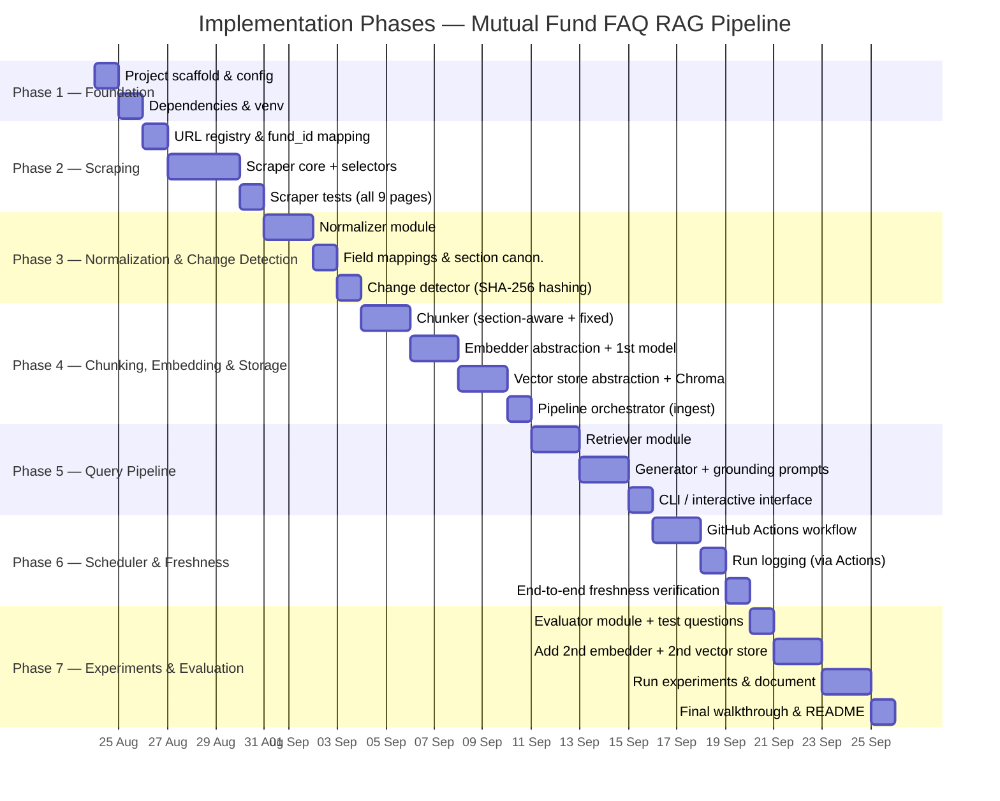

# 📋 Phase-wise Implementation Plan

> **Project:** Mutual Fund FAQ Assistant — RAG Pipeline
> **Derived from:** [ProblemStatement.md](file:///d:/GenAI/Practice/RAG_UC/docs/ProblemStatement.md) · [Architecture.md](file:///d:/GenAI/Practice/RAG_UC/docs/Architecture.md)
> **Document Version:** 1.0
> **Date:** 24 August 2026

---

## Plan Overview

The implementation is organized into **7 phases**, progressing from project foundation through a fully automated, experimentally validated RAG pipeline. Each phase builds on the prior one and results in a **testable milestone**.



### Phase Summary

| Phase | Name | Deliverable | Key FRs Addressed | Key LOs Addressed |
|-------|------|-------------|-------------------|-------------------|
| **1** | Project Foundation | Scaffold, config, dependencies, logging | — | — |
| **2** | Scraping | Working scraper for all 9 pages | FR1 | L1 |
| **3** | Normalization & Change Detection | Clean JSON per fund + hash-based change detection | FR2, FR10 | L2, L9 |
| **4** | Chunking, Embedding & Storage | Full ingestion pipeline: chunk → embed → upsert | FR3, FR4, FR12 | L3, L4, L5 |
| **5** | Query Pipeline | Interactive Q&A with grounded answers + citations | FR5, FR6, FR7, FR8 | L6, L7 |
| **6** | Scheduler & Freshness | Automated refresh + incremental re-indexing | FR9, FR10, FR11 | L8, L9 |
| **7** | Experiments & Evaluation | Documented comparisons + evaluation report | FR12 | L3, L4, L5, L6 |

---

## Phase 1 — Project Foundation

> **Goal:** Set up the project skeleton, dependency management, configuration system, and logging infrastructure so all subsequent phases have a solid base.

### 1.1 Tasks

| # | Task | Files Created/Modified | Details |
|---|------|----------------------|---------|
| 1.1.1 | **Create directory structure** | All dirs per [Architecture §6](file:///d:/GenAI/Practice/RAG_UC/docs/Architecture.md) | Create the full project layout: `src/`, `config/`, `data/`, `vector_db/`, `experiments/`, and all sub-module directories with `__init__.py` files. |
| 1.1.2 | **Initialize Python virtual environment** | `requirements.txt`, `.venv/` | Create `venv`, install initial dependencies. |
| 1.1.3 | **Create `requirements.txt`** | `requirements.txt` | All dependencies across all phases (can install incrementally). |
| 1.1.4 | **Create `config/config.yaml`** | `config/config.yaml` | Full config template per [Architecture §7](file:///d:/GenAI/Practice/RAG_UC/docs/Architecture.md), with all sections (scraper, normalizer, change_detection, chunker, embedder, vector_store, retriever, generator, scheduler, evaluator). |
| 1.1.5 | **Create config loader utility** | `src/config_loader.py` | Utility to load, validate, and access `config.yaml` as a typed dict. Support environment variable overrides for API keys. |
| 1.1.6 | **Set up logging infrastructure** | `src/logger.py` | Configured per [Architecture §16](file:///d:/GenAI/Practice/RAG_UC/docs/Architecture.md): structured JSON log output, separate loggers for pipeline, scheduler, scraper. Console + file destinations. |
| 1.1.7 | **Create `src/main.py` CLI entry point** | `src/main.py` | Skeleton CLI using `argparse` with sub-commands: `scrape`, `ingest`, `query`, `schedule`, `evaluate`. Wired to config and logging. |
| 1.1.8 | **Create `README.md`** | `README.md` | Project overview, quickstart instructions, link to docs. |

### 1.2 Dependencies (Initial Install)

```txt
# Core
requests>=2.31.0
beautifulsoup4>=4.12.0
lxml>=5.0.0
pyyaml>=6.0.0

# Embedding, LLM & Vector Store (primary)
chromadb>=0.5.0
google-generativeai>=0.8.0
groq>=0.9.0

# Scheduler
# Moved to GitHub Actions

# Utilities
python-dotenv>=1.0.0
```

### 1.3 Milestone Checkpoint

| ✅ Criterion | How to Verify |
|-------------|---------------|
| Project runs without error | `python src/main.py --help` prints usage. |
| Config loads correctly | `python -c "from src.config_loader import load_config; print(load_config())"` prints the config dict. |
| Logging works | Log files are created in `data/logs/`. |
| Directory structure matches Architecture §6 | Visual inspection. |

---

## Phase 2 — Scraping

> **Goal:** Build and validate a scraper that reliably extracts fund-fact content from all 9 Groww pages, cleanly separating signal (§4A content) from noise (§4B boilerplate).
>
> **Maps to:** FR1, L1, Stage 1, SC1

### 2.1 Tasks

| # | Task | Files | Details |
|---|------|-------|---------|
| 2.1.1 | **Define fund URL registry** | `src/scraper/urls.py` | Map of all 9 funds: `fund_id` → `{ fund_name, url, category }`. Use the exact URLs from [ProblemStatement §3](file:///d:/GenAI/Practice/RAG_UC/docs/ProblemStatement.md). |
| 2.1.2 | **Analyze Groww page structure** | _(exploratory / notes)_ | Manually inspect 2–3 of the 9 pages in browser DevTools. Identify the CSS selectors or HTML patterns that isolate each fund-fact section (NAV, AUM, expense ratio, holdings table, fund manager, AMC details, exit load, tax info). Document which selectors work across all 9 pages vs. which need per-fund adjustment. |
| 2.1.3 | **Build CSS selectors / extraction rules** | `src/scraper/selectors.py` | Define extraction rules per canonical section: `overview`, `returns`, `holdings`, `exit_load`, `tax_info`, `fund_manager`, `amc_details`. Use labeled-field extraction (not positional) per R1 mitigation. |
| 2.1.4 | **Implement `ScraperResult` dataclass** | `src/scraper/scraper.py` | Define the `ScraperResult` class per [Architecture §3.1](file:///d:/GenAI/Practice/RAG_UC/docs/Architecture.md): `fund_id`, `fund_name`, `source_url`, `raw_sections`, `scraped_at`, `success`, `error`. |
| 2.1.5 | **Implement `scrape_fund()` function** | `src/scraper/scraper.py` | Fetch a single URL, parse HTML with BS4, apply selectors, return `ScraperResult`. Handle HTTP errors, timeouts, and empty selector results gracefully. |
| 2.1.6 | **Implement `scrape_all()` function** | `src/scraper/scraper.py` | Loop through all 9 URLs sequentially, calling `scrape_fund()` for each. Apply configurable delay between requests (`config.scraper.request_delay_seconds`). Collect results, continuing even if some fail _(Assumption A3)_. |
| 2.1.7 | **Implement JSON persistence for raw data** | `src/scraper/scraper.py` | Save each `ScraperResult` to `data/rawdata/<fund_id>.json`. Overwrite on each run to keep the latest raw data. |
| 2.1.8 | **Implement noise rejection** | `src/scraper/selectors.py` | Explicitly filter out: global nav, footer, "Compare similar funds" tables, site-wide link directories (per ProblemStatement §4B). |
| 2.1.9 | **Wire scraper to CLI** | `src/main.py` | `python src/main.py scrape` triggers `scrape_all()` and prints a summary (funds scraped, sections extracted, errors). |
| 2.1.10| **Test scraper on all 9 pages** | _(manual test)_ | Run the scraper and verify: (a) all 9 pages return data, (b) raw data is persisted to `data/rawdata/`, (c) extracted sections contain fund facts and no boilerplate noise, (d) per-section content is non-empty for each canonical section. |

### 2.2 Error Handling (Per Architecture §17)

| Scenario | Behavior |
|----------|----------|
| HTTP timeout / 4xx / 5xx | Log error, set `ScraperResult.success = False`, continue to next fund. |
| CSS selector returns empty | Log warning with fund name + selector. Populate section with `None`, continue. |
| Network completely down | All 9 fail; log critical error. Pipeline still runs next interval. |

### 2.3 Milestone Checkpoint

| ✅ Criterion | How to Verify |
|-------------|---------------|
| `scrape_all()` returns 9 `ScraperResult` objects | Run via CLI; count results. |
| Raw data is persisted correctly | Inspect `data/rawdata/` for 9 JSON files containing raw scraped content. |
| Each result contains populated `raw_sections` for the 7 canonical sections | Inspect output / print section keys. |
| No nav/footer/boilerplate in extracted content | Spot-check 3 funds for noise keywords. |
| Failed pages don't crash the pipeline | Temporarily use a bad URL; confirm the other 8 succeed. |

---

## Phase 3 — Normalization & Change Detection

> **Goal:** Transform raw scraped content into clean, structured JSON per fund and implement hash-based change detection to support incremental updates.
>
> **Maps to:** FR2, FR10, L2, L9, Stages 2–3, SC2, SC5

### 3.1 Tasks — Normalizer

| # | Task | Files | Details |
|---|------|-------|---------|
| 3.1.1 | **Define `NormalizedFund` schema** | `src/normalizer/normalizer.py` | Python dataclass or dict matching the schema from [Architecture §3.2](file:///d:/GenAI/Practice/RAG_UC/docs/Architecture.md). Fields: `fund_id`, `fund_name`, `source_url`, `last_scraped_at`, plus nested objects for `overview`, `returns`, `holdings`, `exit_load`, `tax_info`, `fund_manager`, `amc_details`. |
| 3.1.2 | **Build field mappings** | `src/normalizer/field_mappings.py` | Mapping of raw page text patterns → canonical field names. E.g., "Exp. Ratio" → `expense_ratio`, "Exit Load" → `exit_load`. Handle known variations across the 9 pages. |
| 3.1.3 | **Implement value cleaning** | `src/normalizer/normalizer.py` | - Currency: `₹500` → `500` (numeric) <br/> - Percentage: `1.05%` → `1.05` (float) <br/> - Date: "Feb 19, 2008" → `2008-02-19` (ISO 8601) <br/> - AUM: "₹33,250 Cr" → `33250.0` (float, crores) <br/> - Strip extra whitespace, newlines, HTML entities. |
| 3.1.4 | **Implement `normalize_fund()` function** | `src/normalizer/normalizer.py` | Takes a `ScraperResult`, applies field mappings and value cleaning, returns a `NormalizedFund` dict. |
| 3.1.5 | **Implement JSON persistence** | `src/normalizer/normalizer.py` | Save each `NormalizedFund` to `data/normalized/<fund_id>.json`. Overwrite on each run. |
| 3.1.6 | **Wire normalizer to pipeline** | `src/pipeline.py` | After scrape, pass each `ScraperResult` through `normalize_fund()`. Log normalization results. |
| 3.1.7 | **Validate normalization on all 9 funds** | _(manual test)_ | Run scrape → normalize. Inspect the JSON files in `data/normalized/` for correctness, consistency, and completeness. |

### 3.2 Tasks — Change Detector

| # | Task | Files | Details |
|---|------|-------|---------|
| 3.2.1 | **Implement section hashing** | `src/change_detector/detector.py` | For each canonical section of a `NormalizedFund`, JSON-serialize the section value (sorted keys) and compute SHA-256 hash. |
| 3.2.2 | **Implement hash storage (read/write)** | `src/change_detector/detector.py` | Read previous hashes from `data/hashes/<fund_id>.json`. Write updated hashes after successful indexing. |
| 3.2.3 | **Implement `detect_changes()` function** | `src/change_detector/detector.py` | Compare current section hashes against stored hashes. Return a change manifest per [Architecture §3.3](file:///d:/GenAI/Practice/RAG_UC/docs/Architecture.md): `{ section_name: "changed" | "unchanged" }`. |
| 3.2.4 | **Handle first-run (no prior hashes)** | `src/change_detector/detector.py` | If no hash file exists for a fund, treat ALL sections as "changed" (full initial index). |
| 3.2.5 | **Wire change detector to pipeline** | `src/pipeline.py` | After normalization, call `detect_changes()`. Log which sections changed per fund. Only forward changed sections to the chunking stage. |

### 3.3 Milestone Checkpoint

| ✅ Criterion | How to Verify |
|-------------|---------------|
| `data/normalized/` contains 9 JSON files with correct schemas | Inspect files. |
| Field values are correctly cleaned (numeric NAV, float percentages, ISO dates) | Spot-check 3 funds. |
| First run: change detector marks ALL sections as "changed" | Check logs / manifest output. |
| Second run (no actual changes): change detector marks ALL as "unchanged" | Run again immediately; verify skip log messages. |
| Hash files persist in `data/hashes/` | Inspect directory. |

---

## Phase 4 — Chunking, Embedding & Storage

> **Goal:** Implement the chunk → embed → store pipeline with pluggable strategies for all three stages. Complete the full ingestion pipeline.
>
> **Maps to:** FR3, FR4, FR12, L3, L4, L5, Stages 4–6, SC7

### 4.1 Tasks — Chunker

| # | Task | Files | Details |
|---|------|-------|---------|
| 4.1.1 | **Define `Chunk` dataclass** | `src/chunker/chunker.py` | Per [Architecture §3.4](file:///d:/GenAI/Practice/RAG_UC/docs/Architecture.md): `chunk_id`, `fund_id`, `fund_name`, `section`, `text`, `source_url`, `last_scraped_at`, `chunk_index`, `strategy`. |
| 4.1.2 | **Implement section-aware chunking** | `src/chunker/section_aware.py` | Each canonical section → 1 chunk. If section text exceeds `config.chunker.section_aware.max_chunk_size`, split into sub-chunks with overlap. Assign stable chunk IDs: `{fund_id}::{section}::{index}`. |
| 4.1.3 | **Implement fixed-size chunking** | `src/chunker/fixed_size.py` | Split all normalized text into chunks of `config.chunker.fixed_size.chunk_size` characters with `chunk_overlap` overlap. Assign sequential IDs. |
| 4.1.4 | **Implement chunker orchestration** | `src/chunker/chunker.py` | Factory function: read `config.chunker.strategy` and route to the appropriate strategy. |
| 4.1.5 | **Test chunking output** | _(manual test)_ | Run chunker on 2–3 normalized funds. Verify chunk IDs are stable, chunk text is semantically coherent, and metadata is populated. |

### 4.2 Tasks — Embedder

| # | Task | Files | Details |
|---|------|-------|---------|
| 4.2.1 | **Define `EmbedderInterface` protocol** | `src/embedder/base.py` | Protocol class per [Architecture §3.5](file:///d:/GenAI/Practice/RAG_UC/docs/Architecture.md): `embed(texts) → vectors`, `embed_query(query) → vector`, `model_name`, `dimension`. |
| 4.2.2 | **Implement Gemini embedder (primary)** | `src/embedder/gemini_embedder.py` | Use `google-generativeai` SDK with `text-embedding-004`. Implement batching per `config.embedder.gemini.batch_size`. Handle API key via env var (`GOOGLE_API_KEY`). |
| 4.2.3 | **Implement embedder factory** | `src/embedder/__init__.py` | `create_embedder(config)` factory per [Architecture §13.2](file:///d:/GenAI/Practice/RAG_UC/docs/Architecture.md). Routes based on `config.embedder.provider`. |
| 4.2.4 | **Test embedding on sample chunks** | _(manual test)_ | Embed 5 sample chunks. Verify output dimension matches model spec (768 for Gemini). |

### 4.3 Tasks — Vector Store

| # | Task | Files | Details |
|---|------|-------|---------|
| 4.3.1 | **Define `VectorStoreInterface` protocol** | `src/vector_store/base.py` | Protocol per [Architecture §3.6](file:///d:/GenAI/Practice/RAG_UC/docs/Architecture.md): `upsert()`, `search()`, `delete()`, `count()`. Define `VectorItem` and `SearchResult` dataclasses. |
| 4.3.2 | **Implement ChromaDB store (primary)** | `src/vector_store/chroma_store.py` | Use `chromadb` with persistent storage at `config.vector_store.chroma.persist_dir`. Collection name from config. Map `VectorItem` to Chroma's upsert API. |
| 4.3.3 | **Implement vector store factory** | `src/vector_store/__init__.py` | `create_vector_store(config)` factory. Routes based on `config.vector_store.provider`. |
| 4.3.4 | **Test upsert + search** | _(manual test)_ | Upsert 10 sample chunks, run a test query, verify results include correct chunks with scores. |

### 4.4 Tasks — Pipeline Orchestration

| # | Task | Files | Details |
|---|------|-------|---------|
| 4.4.1 | **Implement full ingestion pipeline** | `src/pipeline.py` | Wire together: `scrape_all()` → `normalize_fund()` → `detect_changes()` → `chunk()` → `embed()` → `upsert()`. Handle the changed/unchanged branching from the change detector. |
| 4.4.2 | **Wire `ingest` to CLI** | `src/main.py` | `python src/main.py ingest` runs the full ingestion pipeline once. Print summary: funds processed, sections changed, chunks upserted. |
| 4.4.3 | **End-to-end ingestion test** | _(manual test)_ | Run `ingest`. Verify: (a) all 9 funds scraped, normalized, chunked, embedded, and stored; (b) `vector_store.count()` shows expected chunk count; (c) hash files updated in `data/hashes/`. |

### 4.5 Milestone Checkpoint

| ✅ Criterion | How to Verify |
|-------------|---------------|
| Full ingestion pipeline runs end-to-end | `python src/main.py ingest` completes without error. |
| Vector store contains chunks for all 9 funds | `vector_store.count()` > 0 and chunks have correct metadata. |
| Chunk IDs are stable across re-runs | Run ingest twice; verify chunk IDs are identical (upserted, not duplicated). |
| Change detection correctly skips unchanged content on 2nd run | Check logs for "unchanged, skipped" messages. |
| Embedding model is pluggable via config | Change `embedder.provider` in config; verify it would load a different model (or test with a mock). |

---

## Phase 5 — Query Pipeline

> **Goal:** Implement the retrieval + grounded generation pipeline so a user can ask natural-language questions and receive factual, cited answers.
>
> **Maps to:** FR5, FR6, FR7, FR8, L6, L7, Stages 7–8, SC3, SC4

### 5.1 Tasks — Retriever

| # | Task | Files | Details |
|---|------|-------|---------|
| 5.1.1 | **Implement retriever module** | `src/retriever/retriever.py` | Accept a question string. Use the embedder to generate a query vector. Call `vector_store.search()` with `config.retriever.top_k` and `config.retriever.similarity_threshold`. Return ranked `SearchResult` list. |
| 5.1.2 | **Implement threshold filtering** | `src/retriever/retriever.py` | Discard results below `config.retriever.similarity_threshold`. If all results are below threshold, return empty list (triggers "not found" in generator). |
| 5.1.3 | **_(Optional)_ Implement hybrid search** | `src/retriever/retriever.py` | If `config.retriever.hybrid.enabled`, additionally run a keyword/BM25 search, merge results using RRF or weighted combination, then apply threshold. |
| 5.1.4 | **Test retrieval with sample questions** | _(manual test)_ | Query with 3–4 sample questions from [ProblemStatement §8](file:///d:/GenAI/Practice/RAG_UC/docs/ProblemStatement.md). Verify retrieved chunks are from the correct fund and correct section. |

### 5.2 Tasks — Generator

| # | Task | Files | Details |
|---|------|-------|---------|
| 5.2.1 | **Create system prompt template** | `src/generator/prompts.py` | Grounded Q&A prompt per [Architecture §3.8](file:///d:/GenAI/Practice/RAG_UC/docs/Architecture.md): answer only from context, cite source URL + timestamp, say "not available" when info is absent, no investment advice. |
| 5.2.2 | **Implement generator module** | `src/generator/generator.py` | Accept question + retrieved chunks. Format chunks into context string. Call the LLM (Groq via `groq` Python SDK) with system prompt + context + question. Parse and return the response. |
| 5.2.3 | **Implement "not found" handling** | `src/generator/generator.py` | If no chunks were retrieved (empty context), return the standard not-found message without calling the LLM (to save cost). |
| 5.2.4 | **Implement citation formatting** | `src/generator/generator.py` | Ensure every answer includes `[Source: <url>, Data as of: <timestamp>]` from the chunk metadata. |
| 5.2.5 | **Test generation with sample questions** | _(manual test)_ | Run 5 questions from the test set. Verify: (a) answers are factually grounded in chunk content, (b) citations are present and correct, (c) Q10 ("dividend policy") triggers a "not found" response. |

### 5.3 Tasks — Interactive Interface

| # | Task | Files | Details |
|---|------|-------|---------|
| 5.3.1 | **Implement `query` CLI command** | `src/main.py` | `python src/main.py query "What is the NAV of HDFC Small Cap Fund?"` runs retriever → generator and prints the answer. |
| 5.3.2 | **Implement interactive loop mode** | `src/main.py` | `python src/main.py query --interactive` enters a REPL loop where the user can ask multiple questions. Type `exit` to quit. |

### 5.4 Milestone Checkpoint

| ✅ Criterion | How to Verify |
|-------------|---------------|
| Single-fund factual questions answered correctly (SC3) | Test Q1–Q6, Q8 from the sample set. |
| Cross-fund comparison question retrieves from multiple funds (Q7) | Test Q7; verify chunks from multiple funds are retrieved. |
| "Not found" correctly handled (SC4) | Test Q10; verify the not-found response. |
| Every answer includes source URL and timestamp (FR8) | Inspect all answer outputs. |
| Retrieval params are tunable via config (L6) | Change `top_k` and `threshold` in config; observe different results. |

---

## Phase 6 — Scheduler & Freshness

> **Goal:** Automate the ingestion pipeline with a configurable scheduler and verify that updated data propagates to query answers.
>
> **Maps to:** FR9, FR10, FR11, L8, L9, Stage 0, SC5, SC6

### 6.1 Tasks

| # | Task | Files | Details |
|---|------|-------|---------|
| 6.1.1 | **Implement GitHub Actions workflow** | `.github/workflows/schedule.yml` | Create a workflow that runs on a `schedule` (cron) and `workflow_dispatch`. It should checkout the code, install dependencies, and run the pipeline (`python -m src.main ingest`). |
| 6.1.2 | **Implement manual trigger** | `src/main.py` | `python src/main.py ingest` triggers a single pipeline run. |
| 6.1.3 | **Implement data persistence** | `.github/workflows/schedule.yml` | Add steps in the workflow to commit changes in `data/rawdata/`, `data/normalized/`, and `data/hashes/` back to the repository so the pipeline is stateful. |
| 6.1.4 | **Verify incremental update** | _(manual test)_ | 1) Run initial ingest. 2) Ask Q9 ("current NAV of HDFC Large Cap Fund"), note the answer. 3) Wait for a scheduler refresh (or force a manual trigger after page content changes). 4) Ask Q9 again — answer should reflect the updated NAV _(SC6)_. |
| 6.1.5 | **Verify change detection skipping** | _(manual test)_ | Run the workflow twice in quick succession. Verify the second run logs "unchanged, skipped" for most/all funds _(SC5)_. Verify no unnecessary re-embedding calls. |

### 6.2 Hash Consistency Rule

> [!WARNING]
> Per [Architecture §17](file:///d:/GenAI/Practice/RAG_UC/docs/Architecture.md), hashes must ONLY be updated AFTER a successful vector store upsert. If the upsert fails, the hash must remain at its previous value so the next scheduler run re-detects the change and retries.

### 6.3 Milestone Checkpoint

| ✅ Criterion | How to Verify |
|-------------|---------------|
| Scheduler runs on configured interval (SC5) | Start scheduler in fast mode; observe pipeline runs every 15 minutes. |
| Run logs are written correctly (FR11) | Inspect `data/logs/` for JSON log files. |
| Changed content is re-indexed, unchanged is skipped (FR10) | Check per-fund log details. |
| Updated NAV propagates to query answers (SC6) | Verify with the Q9 before/after test described above. |
| Scheduler handles single-page failures gracefully | Temporarily break one URL; verify other 8 still process. |

---

## Phase 7 — Experiments & Evaluation

> **Goal:** Add alternative embedding models and vector stores, run the full experiment matrix, and produce a documented comparison report. Deliver the completed evaluation.
>
> **Maps to:** FR12, L3, L4, L5, L6, SC7, Deliverables D3, D4

### 7.1 Tasks — Evaluator

| # | Task | Files | Details |
|---|------|-------|---------|
| 7.1.1 | **Define test question set** | `src/evaluator/test_questions.py` | All 10 questions from [ProblemStatement §8](file:///d:/GenAI/Practice/RAG_UC/docs/ProblemStatement.md) with expected answer patterns, expected source URLs, and testing purpose. |
| 7.1.2 | **Implement evaluator module** | `src/evaluator/evaluator.py` | Iterate over test questions. For each: run retriever → generator, capture answer + source + retrieved chunks + scores. Classify result: `correct` / `incorrect` / `correctly_declined`. |
| 7.1.3 | **Implement evaluation report output** | `src/evaluator/evaluator.py` | Write results to `experiments/eval_<timestamp>.json` with per-question breakdown and overall accuracy. |
| 7.1.4 | **Wire `evaluate` to CLI** | `src/main.py` | `python src/main.py evaluate` runs the full evaluation. |

### 7.2 Tasks — Alternative Implementations

| # | Task | Files | Details |
|---|------|-------|---------|
| 7.2.1 | **Implement Sentence-Transformer embedder** | `src/embedder/sentence_transformer.py` | `all-MiniLM-L6-v2` via `sentence-transformers` library. Local inference, 384-d vectors. Add `sentence-transformers` to `requirements.txt`. |
| 7.2.2 | **_(Optional)_ Implement OpenAI embedder** | `src/embedder/openai_embedder.py` | `text-embedding-3-small` via `openai` SDK. 1536-d vectors. Only if API key is available. |
| 7.2.3 | **Implement FAISS vector store** | `src/vector_store/faiss_store.py` | FAISS index with a JSON sidecar for metadata. Implement upsert as delete+re-add by `chunk_id`. Add `faiss-cpu` to `requirements.txt`. |
| 7.2.4 | **Update factories** | `src/embedder/__init__.py`, `src/vector_store/__init__.py` | Ensure factory functions route to the new implementations correctly. |

### 7.3 Tasks — Run Experiments

| # | Experiment | Config Changes | Steps |
|---|-----------|----------------|-------|
| 7.3.1 | **EXP-E1: Embedding model comparison** | `embedder.provider: gemini` vs `sentence_transformer` | For each model: (1) Clear vector store, (2) Full re-ingest, (3) Run evaluator, (4) Record results. Compare retrieval accuracy, latency, and cost. |
| 7.3.2 | **EXP-V1: Vector store comparison** | `vector_store.provider: chroma` vs `faiss` | For each store: (1) Clear store, (2) Full re-ingest with same embedder, (3) Run evaluator, (4) Record results. Compare query latency, upsert speed, storage size. |
| 7.3.3 | **EXP-C1: Chunking strategy comparison** | `chunker.strategy: section_aware` vs `fixed_size` | For each strategy: (1) Clear vector store, (2) Full re-ingest, (3) Run evaluator, (4) Record results. Compare retrieval accuracy and chunk count. |
| 7.3.4 | **EXP-R1: Retrieval parameter tuning** | Vary `retriever.top_k` and `similarity_threshold` | Run evaluator with 3 parameter sets (per Architecture §15.2). Compare answer quality vs. noise. |

### 7.4 Tasks — Documentation

| # | Task | Files | Details |
|---|------|-------|---------|
| 7.4.1 | **Write experiment report(s)** | `experiments/embedding_comparison.md`, etc. | Per [Architecture §15.3](file:///d:/GenAI/Practice/RAG_UC/docs/Architecture.md) template: Configuration, Results table, Observations, Conclusion. |
| 7.4.2 | **Compile evaluation summary** | `experiments/evaluation_summary.md` | Overall pipeline accuracy on the 10-question test set. Best-performing configuration. Key learnings per learning objective (L1–L9). |
| 7.4.3 | **Finalize `README.md`** | `README.md` | Complete quickstart guide, architecture overview, how to run experiments, link to all docs. |

### 7.5 Milestone Checkpoint

| ✅ Criterion | How to Verify |
|-------------|---------------|
| At least one documented comparison (D3) | Experiment report exists in `experiments/` with side-by-side results. |
| Evaluation log exists (D4) | `experiments/eval_*.json` files with per-question results. |
| Swapping embedder/vector store via config works (SC7, FR12) | Change config; re-run ingest + evaluate; observe different results. |
| Measurable difference observed between configurations (SC7) | At least one experiment shows a quantifiable difference in accuracy or latency. |
| README provides clear quickstart | A new reader can run the pipeline following the README alone. |

---

## Cross-Cutting Concerns

These apply throughout all phases:

### Error Handling (Per Architecture §17)

| Scenario | Phase | Behavior |
|----------|-------|----------|
| Single page scrape fails | 2+ | Log, skip, continue. |
| Page layout changed | 2+ | Log warning, return partial data. |
| Embedding API rate limit | 4+ | Exponential backoff, max retries. |
| Vector store write failure | 4+ | Retry once; don't update hash on failure. |
| LLM generation failure | 5+ | Return graceful error to user. |
| All 9 pages fail | 6 | Log critical; scheduler continues next interval. |

### Configuration (Per Architecture §7)

Every phase uses `config/config.yaml`. No hardcoded values anywhere.

### Logging (Per Architecture §16)

Every phase logs to structured JSON. Console + file output.

---

## Deliverables Checklist

This maps the [ProblemStatement §13 Deliverables](file:///d:/GenAI/Practice/RAG_UC/docs/ProblemStatement.md) to the phases where they are produced.

| Deliverable | Description | Produced In |
|-------------|-------------|-------------|
| **D1** | End-to-end RAG pipeline | Phases 2–5 (complete at end of Phase 5) |
| **D2** | Scheduler component (configurable interval, incremental updates) | Phase 6 |
| **D3** | Documented comparison (embedding / vector store / chunking) | Phase 7 |
| **D4** | Evaluation/run log (question results + scheduler history) | Phase 7 (evaluator) + Phase 6 (scheduler logs) |
| **D5** | ProblemStatement as reference scope | Already complete |

---

## Success Criteria Checklist

| SC | Criterion | Verified In Phase |
|----|-----------|-------------------|
| **SC1** | Scraper extracts fund facts without boilerplate noise | Phase 2 |
| **SC2** | Normalization produces consistent structured records | Phase 3 |
| **SC3** | Pipeline correctly answers single-fund questions with citations | Phase 5 |
| **SC4** | Pipeline correctly declines when answer isn't in corpus | Phase 5 |
| **SC5** | Scheduler detects changed vs. unchanged, re-indexes only changes | Phase 6 |
| **SC6** | Updated values propagate to query answers after refresh | Phase 6 |
| **SC7** | Swapping components produces measurable retrieval quality difference | Phase 7 |

---

## Learning Objectives Coverage

| LO | Objective | Covered In Phases |
|----|-----------|-------------------|
| **L1** | Scraping | Phase 2 |
| **L2** | Normalization | Phase 3 |
| **L3** | Chunking strategies | Phase 4 (build), Phase 7 (compare) |
| **L4** | Embedding model comparison | Phase 4 (build primary), Phase 7 (add alternatives + compare) |
| **L5** | Vector store comparison | Phase 4 (build primary), Phase 7 (add alternative + compare) |
| **L6** | Retrieval tuning | Phase 5 (build), Phase 7 (tune + compare) |
| **L7** | Grounded generation | Phase 5 |
| **L8** | Scheduling & freshness | Phase 6 |
| **L9** | Change detection | Phase 3 (build), Phase 6 (validate with scheduler) |

---

> [!CAUTION]
> **Execution Rule:** Complete each phase's milestone checkpoint before moving to the next. Phases are designed to be sequentially dependent — each builds on the proven output of the prior phase.
