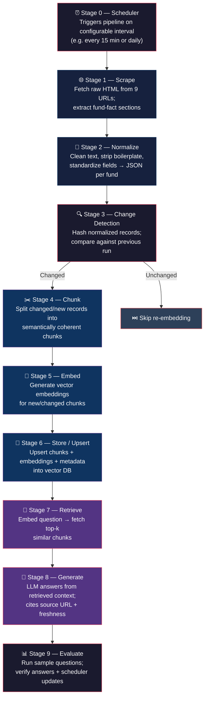

# 📄 Problem Statement

> **Project:** Mutual Fund FAQ Assistant (Facts-Only Q&A) — Learning Project
> **Development Platform:** Antigravity (Agentic Development Environment)
> **Document Version:** 3.0 (Full pipeline: scraping → scheduling → RAG)
> **Date:** 23 August 2026

---

## 1. Overview

This is a **personal learning project** to design and build a complete **Retrieval-Augmented Generation (RAG) pipeline**, developed in Antigravity, covering every core mechanism end-to-end:

| Stage | Capability |
|-------|-----------|
| **Ingestion** | Web scraping & content normalization |
| **Processing** | Chunking & embedding |
| **Storage** | Vector store indexing |
| **Serving** | Retrieval & grounded generation |
| **Freshness** | Scheduled/automated data refresh |

The purpose is **hands-on mastery** of each stage — not a production deployment — but the pipeline should be built _properly_, including the scheduling/freshness layer, so the learning covers the **full lifecycle** a real RAG system needs.

> [!NOTE]
> The assistant answers **factual questions** about a fixed set of **9 mutual fund pages** from [Groww](https://groww.in) (all HDFC-managed schemes spanning different fund categories). The corpus is **small and fixed** in terms of _which_ pages are tracked, but the **content** on those pages (NAV, returns, AUM, etc.) **changes over time** — which is exactly what makes the scheduling/refresh stage a meaningful thing to learn here.

---

## 2. Problem Statement

Build a RAG pipeline that:

1. **Scrapes** content from 9 fixed Groww mutual fund pages.
2. **Normalizes/cleans** that content into a consistent, structured format (stripping site navigation/boilerplate, standardizing fields).
3. **Chunks, embeds, and indexes** the normalized content into a vector store.
4. **Answers** fact-based questions by retrieving and grounding on the indexed chunks, citing the source page.
5. **Keeps the index fresh** via a scheduler that re-scrapes and re-indexes the 9 pages on a configurable interval (e.g. every 15 minutes for fast-changing fields like NAV, or daily for slower-changing fields), updating **only what has changed** rather than blindly rebuilding everything each time.

---

## 3. Fixed Data Source — The Entire Corpus (9 Pages)

| # | Fund Name | Category | URL |
|---|-----------|----------|-----|
| 1 | HDFC Small Cap Fund | Small Cap | [Link](https://groww.in/mutual-funds/hdfc-small-cap-fund-direct-growth) |
| 2 | HDFC Mid Cap Fund | Mid Cap | [Link](https://groww.in/mutual-funds/hdfc-mid-cap-fund-direct-growth) |
| 3 | HDFC Flexi Cap Fund _(listed as "HDFC Equity Fund")_ | Flexi Cap | [Link](https://groww.in/mutual-funds/hdfc-equity-fund-direct-growth) |
| 4 | HDFC Multi Cap Fund | Multi Cap | [Link](https://groww.in/mutual-funds/hdfc-multi-cap-fund-direct-growth) |
| 5 | HDFC Gold ETF Fund of Fund | Gold FoF | [Link](https://groww.in/mutual-funds/hdfc-gold-etf-fund-of-fund-direct-plan-growth) |
| 6 | HDFC Large and Mid Cap Fund | Large & Mid Cap | [Link](https://groww.in/mutual-funds/hdfc-large-and-mid-cap-fund-direct-growth) |
| 7 | HDFC Nifty 50 Index Fund | Index | [Link](https://groww.in/mutual-funds/hdfc-nifty-50-index-fund-direct-growth) |
| 8 | HDFC Large Cap Fund | Large Cap | [Link](https://groww.in/mutual-funds/hdfc-large-cap-fund-direct-growth) |
| 9 | HDFC ELSS Tax Saver Fund | ELSS / Tax Saver | [Link](https://groww.in/mutual-funds/hdfc-elss-tax-saver-fund-direct-plan-growth) |

> [!TIP]
> These span multiple fund categories (Small/Mid/Large/Multi Cap, Large & Mid Cap, Index, ELSS/Tax Saver, Gold FoF), giving variety for both **single-fund lookups** and **cross-fund comparison** questions.

---

## 4. Observed Page Structure (What Scraping/Normalization Must Handle)

Each page mixes two very different kinds of content:

### 4A. ✅ Core Fund-Fact Content (What We Actually Want)

| Content Group | Fields |
|---------------|--------|
| **Live-ish fields** | Current NAV, 1D/1Y/3Y/5Y returns |
| **Slower-changing fields** | AUM (fund size), expense ratio, minimum SIP/lumpsum, risk category, category/sub-category, rating, benchmark index, launch date |
| **Tables** | Top holdings (name, sector, instrument, % assets), returns & rankings vs. category average, exit load history, stamp duty, tax treatment (LTCG/STCG) |
| **Fund management** | Manager name(s), tenure, education, prior experience, other schemes managed |
| **Fund house (AMC) details** | Total AUM, incorporation date, contact/registrar info |

### 4B. ❌ Noise (What Must Be Stripped During Normalization)

| Noise Type | Description |
|------------|-------------|
| **Global site navigation** | Stocks, F&O, IPO, calculators menus |
| **Footer links** | Social links, app download links, legal pages |
| **Cross-fund comparisons** | "Compare similar funds" tables referencing OTHER funds not in our 9-page corpus |
| **Site-wide link directories** | Stock lists A-Z, indices, futures/options chains, etc. that appear on every page |

> [!IMPORTANT]
> This split is the **central scraping/normalization challenge**: a naive full-page scrape pulls in far more noise than signal, which will hurt chunk quality and retrieval precision if not handled.

---

## 5. Learning Objectives

| ID | Objective | Description |
|----|-----------|-------------|
| **L1** | **Scraping** | Build a scraper for the 9 URLs that reliably extracts the fund-fact sections (see §4A) using selectors/patterns, and handles minor page-structure variation across the 9 pages. |
| **L2** | **Normalization** | Clean and standardize scraped content — strip boilerplate/nav noise, normalize currency/percentage formats, normalize field names across pages (e.g. always "Expense Ratio" even if wording differs slightly), and produce a consistent intermediate representation (e.g. structured JSON per fund) before chunking. |
| **L3** | **Chunking** | Experiment with chunking strategies — fixed-size vs. section-aware (e.g. separate chunks for "Holdings", "Exit Load", "Fund management", "About the fund") — and observe effects on retrieval quality. |
| **L4** | **Embedding** | Compare at least 2–3 embedding models and observe differences in retrieval accuracy on the same question set. |
| **L5** | **Vector Storage** | Compare at least 2 vector database options for indexing/query performance on this small, frequently-updated corpus — including how each handles upserts/updates, not just initial inserts. |
| **L6** | **Retrieval Tuning** | Observe effects of top-k, similarity threshold, and hybrid keyword+vector search on answer correctness. |
| **L7** | **Grounded Generation** | Answer only from retrieved chunks; say "not found in the indexed pages" when the answer isn't present. |
| **L8** | **Scheduling & Freshness** | Design and run a scheduler that periodically re-scrapes the 9 pages and updates the index, and learn the tradeoffs between full re-index vs. incremental/change-aware updates, and between a fast interval (~15 min, for NAV-like fields) vs. a slower one (daily, for stable fields like expense ratio or fund manager). |
| **L9** | **Change Detection** | Learn a simple way to detect whether a page's content actually changed since the last scrape (e.g. hashing the normalized content per section) so the pipeline avoids unnecessary re-embedding/re-indexing when nothing changed. |

---

## 6. Scope

### 6.1 ✅ In Scope

- Scraper for exactly the 9 listed URLs.
- Normalization step producing a clean, structured intermediate format per fund (before chunking).
- Chunking, embedding, and indexing of normalized content.
- Retrieval + grounded generation, citing the source URL per answer.
- A **scheduler component** that re-runs the scrape → normalize → (re)index flow on a **configurable interval** (e.g. every 15 minutes or daily — configurable, not hardcoded to one cadence).
- **Change detection** so the scheduler only re-embeds/re-indexes content that has actually changed, rather than always doing a full rebuild.
- Comparing embedding models / vector DBs / chunking strategies as a hands-on experiment (the core learning deliverable).
- A small set of **test questions** with known-correct answers to sanity-check retrieval and generation quality, including verifying that a scheduled refresh correctly updates a previously-answered fact (e.g. NAV) after re-scraping.

### 6.2 ❌ Out of Scope

| Area | Why Excluded |
|------|-------------|
| Content beyond these 9 pages | No broader AMC/AMFI/SEBI ingestion, no other AMCs |
| Production-grade scheduling infra | No need for a full workflow orchestrator like Airflow — a lightweight scheduler (cron-style job or simple interval loop) is sufficient for learning |
| Investment advice / recommendations | Strictly factual Q&A only |
| Compliance, audit logging, production security | Local learning sandbox, not a deployed product |
| Multi-user/session infra, auth, alerting, scaling | Single-user personal project |
| Anti-scraping countermeasures | No CAPTCHAs, proxy rotation, etc. — basic, respectful request patterns only |

---

## 7. Functional Requirements

| ID | Requirement |
|----|-------------|
| **FR1** | Scrape and extract fund-fact content from the 9 fixed URLs. |
| **FR2** | Normalize scraped content into a consistent structured format per fund (e.g. JSON with fields: `nav`, `expense_ratio`, `aum`, `min_sip`, `exit_load`, `category`, `benchmark`, `fund_manager`, `holdings`, `launch_date`, `source_url`, `last_scraped_at`). |
| **FR3** | Chunk normalized content and generate embeddings. |
| **FR4** | Store chunks + embeddings + metadata in a vector database. |
| **FR5** | Accept a natural-language question about any of the 9 funds. |
| **FR6** | Retrieve relevant chunks via vector similarity search. |
| **FR7** | Generate an answer grounded **only** in retrieved chunks; state clearly when information isn't available in the corpus. |
| **FR8** | Show the **source URL** and **last-updated timestamp** the answer's data came from. |
| **FR9** | Run a scheduler that re-triggers scrape → normalize → index on a **configurable interval** (default suggestion: every 15 min for "live" demo mode, or once daily for lower-frequency mode) — interval should be a config value, not hardcoded. |
| **FR10** | Detect whether scraped content changed since the last run (e.g. via content hash per fund/section) and **skip re-embedding** for unchanged sections to save compute/API cost. |
| **FR11** | Log each scheduler run: timestamp, which funds were checked, which changed, which were re-indexed. |
| **FR12** | Allow easy swapping of the embedding model and/or vector store via configuration, to support experimentation. |

---

## 8. Sample Test Questions (For Evaluating the Pipeline)

| # | Question | Testing Purpose |
|---|----------|-----------------|
| 1 | _"What is the minimum SIP amount for HDFC Mid Cap Fund?"_ | Single-fund factual lookup |
| 2 | _"What is the expense ratio of HDFC Nifty 50 Index Fund?"_ | Single-fund factual lookup |
| 3 | _"What is the exit load for HDFC ELSS Tax Saver Fund?"_ | Table/structured data retrieval |
| 4 | _"Who is the fund manager of HDFC Large Cap Fund and what is their prior experience?"_ | Multi-field retrieval (name + experience) |
| 5 | _"What is the benchmark index for HDFC Multi Cap Fund?"_ | Single-fund factual lookup |
| 6 | _"What is the AUM of HDFC Gold ETF Fund of Fund?"_ | Single-fund factual lookup |
| 7 | _"Which of these 9 funds has the lowest expense ratio?"_ | **Cross-document comparison** (harder retrieval case) |
| 8 | _"What is the risk category of HDFC Small Cap Fund?"_ | Single-fund factual lookup |
| 9 | _"What is the current NAV of HDFC Large Cap Fund?"_ | **Scheduler test**: ask again after a scheduled refresh and confirm the answer reflects the newly-scraped NAV |
| 10 | _"What is the dividend policy of HDFC Large Cap Fund?"_ | **"Not found" test**: should trigger a "not found in the indexed pages" response if not present on page |

---

## 9. Success Criteria

| # | Criterion |
|---|-----------|
| **SC1** | Scraper reliably extracts the core fund-fact fields (§4A) from all 9 pages **without** pulling in significant navigation/boilerplate noise. |
| **SC2** | Normalization produces a consistent structured record per fund that chunking can work from cleanly. |
| **SC3** | Pipeline correctly answers **single-fund factual questions** using only the relevant page's content, with correct source citation. |
| **SC4** | Pipeline correctly **declines/flags** when an answer isn't present in the corpus rather than guessing. |
| **SC5** | Scheduler runs on its configured interval, correctly detects changed vs. unchanged content, and re-indexes **only what changed**. |
| **SC6** | After a scheduled refresh picks up a changed value (e.g. NAV), a repeated question returns the **updated** value, not the stale one. |
| **SC7** | You can swap an embedding model, vector DB, or chunking strategy and observe/compare a **measurable difference** in retrieval quality on the same question set. |

---

## 10. Proposed Pipeline (High Level)

### Stage-by-Stage Details

| Stage | Name | Description |
|-------|------|-------------|
| **Stage 0** | Scheduler | Triggers the pipeline run on a configurable interval (e.g. every 15 min or daily). Can also be triggered manually for development. |
| **Stage 1** | Scrape | Fetch raw HTML from each of the 9 URLs; extract the fund-fact sections (NAV, returns, AUM, expense ratio, holdings, exit load, tax info, fund manager, benchmark, launch date, AMC details). |
| **Stage 2** | Normalize | Clean extracted text, strip navigation/boilerplate, standardize field names/formats, and produce a structured per-fund record (e.g. JSON) with a `last_scraped_at` timestamp. |
| **Stage 3** | Change Detection | Hash each normalized record (or per-section) and compare against the previous run's hash. Mark unchanged sections to skip, changed sections to re-embed. |
| **Stage 4** | Chunk | Split changed/new normalized records into semantically coherent chunks (test both fixed-size and section-aware chunking). |
| **Stage 5** | Embed | Generate vector embeddings for new/changed chunks using the embedding model under test. |
| **Stage 6** | Store / Upsert | Upsert chunks + embeddings + metadata (`fund_name`, `source_url`, `section`, `last_scraped_at`) into the vector DB under test — replacing stale chunks for changed funds, leaving unchanged ones untouched. |
| **Stage 7** | Retrieve | On query, embed the question and fetch top-k similar chunks. |
| **Stage 8** | Generate | Pass retrieved chunks + question to the LLM with instructions to answer only from provided context, cite the source URL, and mention data freshness (`last_scraped_at`) if relevant. |
| **Stage 9** | Evaluate | Run the sample question set, check answers and cited sources against the known page content, and verify scheduler-driven updates propagate correctly. |

---

## 11. Assumptions

| # | Assumption |
|---|-----------|
| **A1** | This is a **single-user, local/personal learning environment** built within Antigravity — no deployment, multi-tenancy, or compliance review is required. |
| **A2** | Scraping these 9 public pages at a reasonable interval (e.g. not faster than every 15 minutes) for personal learning purposes is acceptable; no aggressive/high-frequency polling is intended. |
| **A3** | Page structure may change on Groww's site over time; the scraper should be built to **fail gracefully** (skip/flag a page) rather than break the whole pipeline if one page's layout changes. |
| **A4** | "Every 15 minutes" and "daily" are example cadences to demonstrate both a fast and slow refresh mode — the actual interval is a **configuration choice**, not a fixed requirement. |

---

## 12. Risks & Mitigations (Learning-Scope Version)

| Risk ID | Risk | Mitigation |
|---------|------|-----------|
| **R1** | Page structure differs slightly across the 9 fund pages (e.g. different section ordering) | Build extraction around **labeled fields/headers** rather than rigid positional parsing. |
| **R2** | Frequent scraping could be mistaken for abusive traffic | Keep interval reasonable (15 min minimum suggested), use standard request headers, avoid parallel hammering of the same page. |
| **R3** | Re-embedding everything on every run wastes time/API cost | **Change-detection (hashing)** as described in Stage 3. |
| **R4** | Vector DB accumulates stale duplicate chunks after repeated re-indexing | **Upsert by a stable chunk ID** (e.g. `fund_id` + `section_name`) rather than always inserting new IDs. |

---

## 13. Deliverables

| ID | Deliverable |
|----|------------|
| **D1** | A working **end-to-end RAG pipeline** in Antigravity: scraper → normalizer → change detector → chunker → embedder → vector store → retriever → generator. |
| **D2** | A **scheduler component** (configurable interval, e.g. 15-min and daily modes) that automatically re-runs the pipeline and updates the index incrementally. |
| **D3** | At least **one documented comparison**: two embedding models OR two vector DBs OR two chunking strategies, run against the sample question set, with observed differences noted. |
| **D4** | A small **evaluation/run log** capturing: sample question results (correct / incorrect / correctly declined) and scheduler run history (timestamp, funds changed, funds re-indexed). |
| **D5** | This **ProblemStatement** as the reference scope document for development in Antigravity. |

---

> [!CAUTION]
> This document serves as the **single source of truth** for the project scope. All design and implementation decisions should be traceable back to the requirements, learning objectives, and success criteria defined here.
